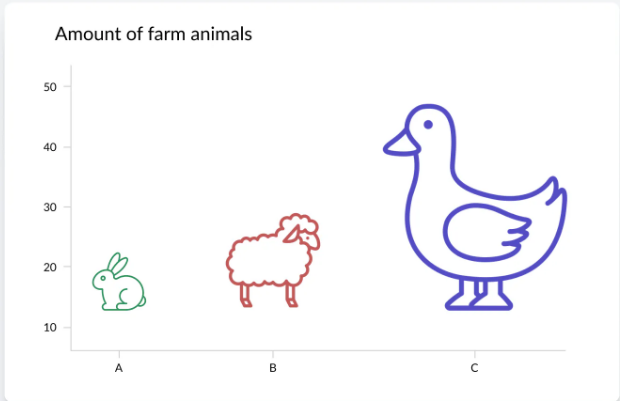
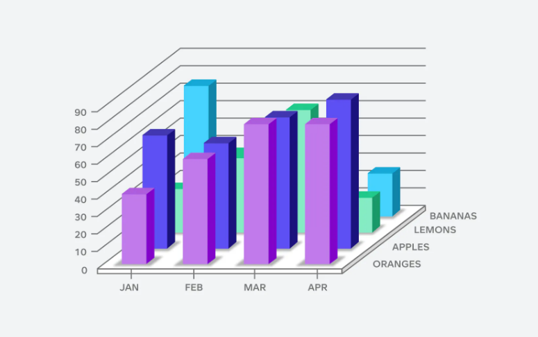
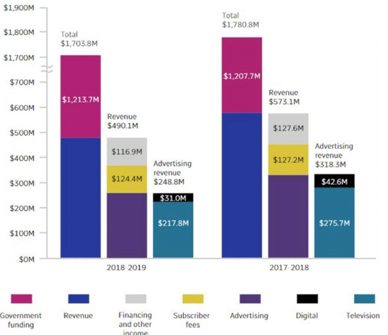

## Graphique 1 

**Ce qui ne va pas :**
- Taille globale des images ne contribue pas à la représentation des points de données
-	Mauvaise indication des chiffres
-	Titre trop court
-	Manque d’unités sur les axes abscisses et ordonnés 

**Comment éviter ça :**
-	Avoir une échelle cohérente
-	S’assurer que tous les éléments visuels jouent un rôle clair et pertinent dans la transmission des données
-	Mettre un titre avec une meilleure indication de ce qu’on analyse
-	Indiquer l’unité de mesure

## Graphique 2

**Ce qui ne va pas :**
-	Trop d’informations
-	Manque de fonctionnalités interactives telles que le filtrage ou l’exploration en profondeur
-	Toutes les données sont présentées d’un seul coup donc les visuels sont encombrés et masquent les informations clés

**Comment éviter ça :**
-	Utiliser de fonctionnalités interactives pour créer des tableaux et des graphiques clairs 
-	Choisir un meilleur type de graphique pour pouvoir voir toutes informations (les barres vertes sont cachées)
-	Eviter les graphiques en 3D si ce n’est pas nécessaire

## Graphique 3

**Ce qui ne va pas :**
-	Axe des abscisses est inversé (la période la plus récente est à gauche)
-	On ne sait pas ce que représente la succession des 2 dates => manque de précision
-	Trop de choses à voir, trop d’informations entre le texte, les couleurs, la légende

**Comment éviter ça :**
-	Prendre un autre type de graphique pour cette analyse car les 3 barres ne sont pas représentatives
-	Des indicateurs visuels auraient pu être utilisés pour grouper les informations qui devaient l’être, pouvoir même regrouper toutes les informations dans un camembert pour chaque date pour améliorer la visibilité 
-	Ajouter un titre  

